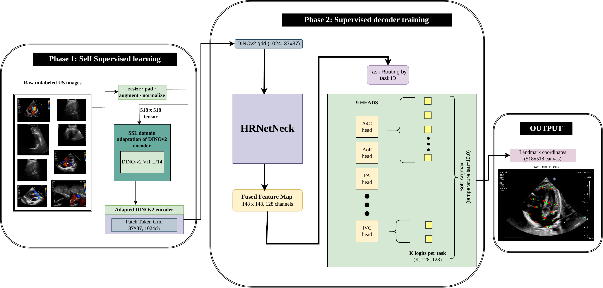

# DINOv2-HRNet for GU/FU Biometry

Self-supervised domain adaptation with a DINOv2-L/14 encoder + a multi-stage
HRNet-style neck, for multi-task ultrasound landmark detection on the
**GU/FU Biometry MICCAI 2026 Challenge** (Codabench competition 15590) — nine
landmark tasks spanning intrapartum, prenatal, and cardiac ultrasound.

This repository started as the code behind the paper *"Self-Supervised Domain
Adaptation with DINOv2-HRNet for Multi-Task Ultrasound Landmark Detection"* and has
since been rebuilt into an installable, config-driven package (`gubiometry/`) with
a set of challenge-specific and general best-practice upgrades layered on top. The
**original two-phase DINOv2 approach is preserved end to end** — every upgrade is
opt-in and documented against exactly what it changes.



---

## Table of contents

- [Why this design](#why-this-design)
- [Pipeline](#pipeline)
- [Repository structure](#repository-structure)
- [Setup](#setup)
- [Data layout](#data-layout)
- [Usage](#usage)
- [Method upgrades](#method-upgrades)
- [Experiment knobs](#experiment-knobs)
- [Current status](#current-status)
- [Documentation map](#documentation-map)
- [Citation](#citation)
- [License](#license)

---

## Why this design

The challenge score is **50% mean radial error (original-image pixels) + 50%
derived clinical-measurement error** (the AOP angle in degrees; every other
measurement — head circumference, femur length, chamber distances, etc. — in
pixels), **macro-averaged with equal weight across all 9 tasks**. Two facts fall
out of that and shape most of the engineering here:

1. **Task sample counts are wildly imbalanced** (AOP ≈ 4000 labeled images vs. IVC
   ≈ 30, PSAX ≈ 39, A4C ≈ 86), but the macro-average weights every task equally —
   so the tiny cardiac tasks matter as much as the near-solved AOP task and
   dominate the achievable score. This motivates cross-validation, ensembling, and
   test-time augmentation as the single biggest lever, and a sampling-temperature
   knob so the tiny tasks aren't drowned out or overfit.
2. **Keypoints are strictly ordered and semantic** — each measurement is derived
   from specific keypoint index pairs (e.g. AOP = angle between two specific
   vectors; head circumference = an ellipse from two specific diameters). This
   rules out naive flip augmentation without an explicit per-task index
   permutation, and it means the *training loss space* (518-canvas pixels,
   originally) should be aligned with the *scoring space* (original-image pixels)
   rather than left to drift.

See [METHOD_CHANGES.md](METHOD_CHANGES.md) for the full reasoning and every change
this drove, and [`gubiometry/metrics.py`](gubiometry/metrics.py) for the
challenge-accurate scorer (it reproduces the committed official local-evaluation
numbers exactly, keypoint-index-pair table included).

## Pipeline

A two-stage pipeline that separates domain-level representation learning from
task-specific spatial localization:

- **Phase 1 — SSL domain adaptation.** A DINOv2-L/14 (or register-variant)
  encoder is adapted to unlabeled ultrasound frames with a student–teacher
  objective (EMA teacher). Two variants, both in `gubiometry/engine/phase1.py`:
  - `sameview` — same full-frame tensor to both branches. Simpler, but prone to
    same-view representational collapse under extended training.
  - `multicrop` (recommended) — asymmetric multi-crop augmentation (DINO-style
    global/local crops), fixing the collapse above.
- **Phase 2 — multi-stage HRNet neck + soft-argmax heads.** The adapted encoder
  feeds a top-down, multi-resolution HRNet-style neck
  (`gubiometry/models/neck.py`) that repeatedly exchanges information across
  three resolution branches before fusion. Nine task-specific heads then produce
  per-keypoint logits, and continuous coordinates are extracted via
  temperature-scaled soft-argmax. See [docs/ARCHITECTURE.md](docs/ARCHITECTURE.md)
  for a full walkthrough of the neck design (top-down vs. bottom-up exchange,
  branch-width choices, why plain softargmax over a heatmap-MSE hybrid).

Layered on top of that original method: multi-level DINOv2 feature aggregation
into the neck, layer-wise LR decay, a DSNT heatmap regularizer, a register
backbone, 5-fold cross-validation with ensemble + TTA prediction, and a set of
general best-practice fixes (heatmap resolution, weight-decay exclusion, bf16).
All are opt-in — see [Method upgrades](#method-upgrades).

## Repository structure

The pipeline lives in the installable `gubiometry/` package, driven by one CLI
(`python -m gubiometry ...`) and YAML configs.

```
├── gubiometry/
│   ├── __main__.py       # CLI: phase1 | phase2 | kfold | predict | evaluate | make-splits
│   ├── config.py         # YAML/dataclass config (+ legacy config.json adapter)
│   ├── constants.py      # task list / keypoint counts (single source of truth)
│   ├── geometry.py       # soft-argmax decode + letterbox forward/inverse (pure numpy/torch)
│   ├── metrics.py        # challenge scorer (reproduces the official local eval exactly)
│   ├── losses.py         # soft-argmax loss (+ optional DSNT, Wing, measurement-aligned aux)
│   ├── optim.py          # LLRD param groups, scheduler, EMA
│   ├── models/           # backbone (single|multilevel, register, dummy), neck, heads, model
│   ├── data/             # dataset, samplers, transforms, multicrop, splits (+ k-fold)
│   ├── engine/           # phase1, phase2 (metric-aligned), kfold, predict (ensemble×TTA), evaluate
│   └── testing/          # synthetic data + dummy-backbone harness (CPU smoke tests, no GPU/hub needed)
├── configs/               # phase1_multicrop, phase2_baseline, phase2_upgraded,
│   └── experiments/       # predict_ensemble, submit_val + one-knob ablation configs
├── scripts/               # thin shell wrappers around the CLI
├── src/visualization/     # paper qualitative-figure scripts (rewired onto gubiometry)
├── data/                  # dataset layout notes + the exact train/val split (no images)
├── pretrained/             # place Phase 1 checkpoints here
├── docs/ARCHITECTURE.md    # Phase 2 neck design notes
├── METHOD_CHANGES.md        # every upgrade: what it is, why, paper impact, opt-in flag
├── EXPERIMENTS.md            # full ablation-knob reference
├── RUNBOOK.md                 # copy-paste commands for this machine (GPUs, data paths, order)
└── FIXES.md                    # small correctness/usability fixes from the original codebase
```

## Setup

```bash
git clone <this-repo>
cd dinov2-hrnet-gu-biometry
python -m venv .venv && source .venv/bin/activate
pip install -e .            # or: pip install -r requirements.txt
```

`pip install -e .` installs the core (torch, numpy, pandas, scikit-learn, PyYAML,
tqdm, Pillow) needed for inference/evaluation/metrics. Training augmentation and
image decoding additionally need `albumentations`, `opencv-python-headless`, and
(optionally) `tensorboard` — `pip install -e ".[train]"`, or see
`requirements.txt` for exact pinned versions. If these aren't installed, training
still runs: image decoding falls back to PIL, augmentation falls back to a
no-augmentation letterbox (with a warning), and TensorBoard logging becomes a
no-op — this is deliberate, so the pipeline degrades gracefully rather than
hard-failing.

First run of any `phase1`/`phase2` command downloads the DINOv2 backbone weights
from `torch.hub` (~1.1 GB for ViT-L/14) into `~/.cache/torch_gu_biometry`.

## Data layout

The dataset itself is not shipped — only `data/splits/` (the exact 80/20
train/val split and the local ground-truth JSON used for reproducible scoring) is
tracked. Arrange the real GU/FU Biometry data under a `data_root` directory (set
via `data.data_root` in a config, or `-o data.data_root=/path/to/data`) following
[data/README.md](data/README.md):

```
data_root/
├── images/<TASK_ID>/{labeled,unlabeled}/*.png|jpg   # TASK_ID in the 9 valid tasks
├── csv/*.csv                                        # task_id, image_path, point_* columns
└── splits/
    ├── train_val_split_keys.json                    # holdout split (generated once)
    ├── kfold_v1/fold_{0..4}.json                     # 5-fold splits (generated once)
    └── local_eval_gt/internal_ground_truth_val.json # GT for local scoring
```

`RobustBiometryDataset` (`gubiometry/data/dataset.py`) indexes `images/` recursively
by `(task_id, filename)`, so exact subfolder nesting is flexible as long as a valid
task name appears somewhere in the path; a file is unlabeled if the literal string
`unlabeled` appears anywhere in its path.

## Usage

Everything runs through one CLI, configured by a YAML file plus dotted `-o`
overrides. This is the **default path from a clean checkout to a challenge
submission** — for the exact commands and GPU/data-path specifics of *this*
machine, see [RUNBOOK.md](RUNBOOK.md); for what each config knob does, see
[EXPERIMENTS.md](EXPERIMENTS.md).

```bash
# 1. Splits: an 80/20 holdout and/or 5 stratified folds (by task_id, seed 42)
python -m gubiometry make-splits --data-root data_root
python -m gubiometry make-splits --data-root data_root --kfold --n-splits 5

# 2. Phase 1: SSL domain adaptation on unlabeled frames (multi-crop recommended;
#    pick the backbone here -- the adapted encoder is backbone-specific)
python -m gubiometry phase1 --config configs/phase1_multicrop.yaml \
  -o model.backbone.name=dinov2_vitl14_reg

# 3. Phase 2: supervised HRNet-neck training from the Phase-1 checkpoint.
#    "baseline" = original method (pinned legacy recipe); "upgraded" = every
#    challenge/best-practice improvement (see below), the recommended config.
python -m gubiometry phase2 --config configs/phase2_upgraded.yaml \
  -o phase1_weights=runs/phase1_multicrop/checkpoints/dinov2_adapted_ep30.pth

# 4. 5-fold training (the ensemble members) instead of a single holdout run
python -m gubiometry kfold --config configs/phase2_upgraded.yaml \
  -o phase1_weights=runs/phase1_multicrop/checkpoints/dinov2_adapted_ep30.pth

# 5. Ensemble + multi-scale/intensity TTA -> Codabench validation submission
#    (predicts every image under data_root/val_data/<task>/<file>.png in the
#    committed {image_path, task_id, predicted_points_normalized,
#    predicted_points_pixels} format, zipped)
python -m gubiometry predict --config configs/submit_val.yaml

# 6. Score any submission against a ground-truth JSON with the challenge metric
python -m gubiometry evaluate --config configs/predict_ensemble.yaml \
  -o predict.gt_json=data_root/splits/local_eval_gt/internal_ground_truth_val.json
```

`scripts/*.sh` are thin wrappers around the same commands. Every run writes to
`runs/<run_name>/`: `config.json` (the exact resolved config — later reused to
auto-rebuild the model for prediction/evaluation/visualization, no hand-matching
hyperparameters), a text log, TensorBoard event files, and
`checkpoints/best_teacher_model.pth` (the EMA teacher, selected on the
challenge-aligned metric) + `latest_checkpoint.pth` (full resumable state).

**CPU smoke testing (no GPU, no dataset, no `torch.hub` download):** set
`-o model.backbone.name=dummy` and build a throwaway dataset with
`gubiometry.testing.build_synthetic_dataset(...)`; this is how every code path in
this repo was verified end to end before running on real data/GPUs.

## Method upgrades

These are the **defaults now** — the most-promising, generally-safe settings are
baked into `gubiometry/config.py`, so a bare `phase2` run uses the recommended
recipe. `configs/phase2_baseline.yaml` pins the exact original-method recipe as a
permanent reference point; `configs/phase2_upgraded.yaml` is the same defaults plus
the A100 run-scale (batch 64, lr 2e-4, 150 epochs). Full detail, rationale, and
paper impact for each: **[METHOD_CHANGES.md](METHOD_CHANGES.md)**.

| Upgrade | What it is | Default (legacy override) |
|---|---|---|
| Metric-aligned selection | Checkpoints selected on the real challenge metric (original-px MRE + measurement MAE), not 518-canvas loss | always on |
| Multi-level DINOv2 features | 4 intermediate ViT depths feed the neck (DPT/ViTPose-style), not just the last layer | `input_mode: multilevel` (`single`) |
| Register backbone | `dinov2_vitl14_reg` for cleaner dense features (Phase-1 backbone must match) | `dinov2_vitl14_reg` (`dinov2_vitl14`) |
| Layer-wise LR decay | Depth-decayed encoder LR — the canonical ViT fine-tuning recipe | `llrd_decay: 0.75` (`1.0`) |
| DSNT regularizer | Keeps soft-argmax heatmaps tight/unimodal without a fixed-amplitude heatmap-MSE target | `dsnt_lambda: 0.1` (`0.0`) |
| Best-practice defaults | Heatmap matched to the neck (128→148), sqrt task sampling, original-px loss, weight decay excluded from norms/biases, bf16 on Ampere | on (`phase2_baseline.yaml` pins the old values) |
| 5-fold CV + ensemble + TTA | Stratified folds, coordinate-space ensembling, safe multi-scale/intensity TTA (no naive flips — keypoints are semantic) | workflow opt-in: `gubiometry kfold` + `predict` |

## Experiment knobs

Beyond the recommended recipe, a curated set of alternative-experiment knobs are
available for ablation — alternative coordinate losses (Wing, Huber), a
measurement-aligned auxiliary loss, augmentation-strength presets, sampling
temperature, median ensembling, out-of-fold local evaluation, LR schedule choice,
and backbone/heatmap-resolution capacity sweeps. Every knob defaults to the
recommended-recipe value; ready-made one-change configs live in
`configs/experiments/`. Full reference: **[EXPERIMENTS.md](EXPERIMENTS.md)**.

## Current status

- **Pipeline built and verified**: the full `gubiometry` package (config system,
  models incl. multi-level/register/dummy backbones, metric-aligned training,
  5-fold CV, ensemble+TTA prediction, submission generation) is implemented and
  gated by CPU-only unit/integration tests plus real-GPU smoke runs.
- **Scorer validated**: `gubiometry/metrics.py` reproduces the challenge's own
  committed local-evaluation numbers exactly (Average MRE and per-measurement MAE,
  matched to 4 decimal places against `data/data/train_data/splits/local_eval_gt_v7/`).
- **First real baseline trained** (`runs/p2_baseline_nossl`, no Phase-1 SSL,
  pre-best-practice-audit recipe, single holdout): 46 epochs (early-stopped),
  best at epoch 26, **23.8 px average MRE / 16.5 measurement MAE** on the 1354-image
  holdout — already ahead of the reference `local_eval_gt_v7` numbers (32.6 / 26.4)
  on 7 of 9 tasks, with essentially all remaining error concentrated in the
  low-data cardiac tasks (PSAX, A4C, fetal_femur, IVC), exactly where the CV +
  ensemble + TTA + sampling-temperature levers are aimed.
- **A validation submission has been generated and format-verified**
  (`submission_baseline.zip`, 619/619 challenge validation images covered,
  committed JSON schema) from that baseline model, as an end-to-end sanity check
  of the Codabench submission path ahead of the full recipe.
- **Not yet run**: Phase 1 SSL domain adaptation, the upgraded 5-fold ensemble,
  and the best-practice-audit recipe (heatmap 148 / LLRD / bf16 / sqrt sampling /
  original-px loss) at scale — these are next. See [RUNBOOK.md](RUNBOOK.md) for
  the exact planned order and commands.

## Documentation map

| Document | Read this for |
|---|---|
| **README.md** (this file) | Orientation: what this is, how the pieces fit, how to run it |
| [docs/ARCHITECTURE.md](docs/ARCHITECTURE.md) | The Phase-2 HRNet neck design in detail |
| [METHOD_CHANGES.md](METHOD_CHANGES.md) | Every upgrade over the original method: what, why, paper impact, shape-breaking/re-Phase-1 flags |
| [EXPERIMENTS.md](EXPERIMENTS.md) | Every ablation knob: values, meaning, example configs |
| [RUNBOOK.md](RUNBOOK.md) | Copy-paste commands for this machine: GPU picking, data paths, recommended run order, alternative paths to try |
| [FIXES.md](FIXES.md) | Small correctness/usability fixes applied to the original codebase |
| [CLAUDE.md](CLAUDE.md) | Terse orientation for AI coding agents working in this repo |
| [data/README.md](data/README.md) | Expected dataset layout in detail |
| [pretrained/README.md](pretrained/README.md) | Phase-1 checkpoint shape/placement |

## Citation

If you use this code, please cite:

```bibtex
@inproceedings{panagiotakopoulou2026dinov2hrnet,
  title     = {Self-Supervised Domain Adaptation with DINOv2-HRNet for Multi-Task Ultrasound Landmark Detection},
  author    = {Panagiotakopoulou, Anna and Barberis, Alexandros and Katsigiannis, Vasileios E. and Matsopoulos, George K.},
  booktitle = {MICCAI},
  year      = {2026}
}
```

## License

CC BY-NC 4.0 (non-commercial) — see [LICENSE](LICENSE). This was chosen as a
conservative default given the underlying GU/FU Biometry challenge dataset;
verify against the challenge's exact Code Availability requirement (Codabench
competition page) before public release.
