# v3: "True" Multi-Stage HRNet Neck + Plain Softargmax

> Note: these are the original design notes from the research codebase this
> repo was extracted from. They describe the final Phase 2 architecture
> (`src/models/architecture_hrnet.py`, `TrueHRNetNeck`) in contrast to the
> earlier single-stage, late-fusion `HRNetStyleNeck` in
> `src/models/architecture_ablation.py`. That file is still included here --
> not as an alternative Phase 2 option, but because `train_phase1_multicrop.py`
> reuses it internally for Phase 1's own pretext-task decoder. Kept for
> context on *why* the final Phase 2 design looks the way it does.

## What this is

A neck redesign that replaces the previous single-stage, late-fusion
`HRNetStyleNeck` (used in `experiments/v2_partial_unfreeze_reg` and
`architecture_ablation.py`) with an actual multi-stage HRNet: branches are
spawned progressively and **repeatedly exchange information** with each other
before final fusion, instead of being computed in isolation and summed once at
the end.

Backbone (frozen/partially-unfrozen DINOv2-L, 37x37 patch grid) is unchanged.
Only the neck (`TrueHRNetNeck` in `architecture_hrnet.py`) and the loss
(plain softargmax-on-coordinates, no heatmap auxiliary term) differ from v2.

## Full pipeline: image in, keypoints out

```
=================== 1. BACKBONE ENCODER ===================
                 [Input Ultrasound Image]
                            |
         [Domain-Adapted DINOv2 L/14 (Phase 1 checkpoint)]
                            |
               Coarse Token Grid (37x37)

==================== 2. HRNet DECODER =====================
                            |
             [ Multi-Stage HRNet Exchange ]
       (B1, B2, and B3 cross-talk repeatedly --
        see "Top-down vs. bottom-up" above)
                            |
                 [ Element-wise SUM + Conv Smoothing ]
                            |
               Fused Feature Map (148x148, 128ch)

=================== 3. TASK ROUTING GATE ===================
                            |
        Which of the 9 tasks is this batch?
   (A4C, AOP, FA, FUGC, HC, IVC, PLAX, PSAX, fetal_femur --
    fixed per-batch via task-homogeneous sampling, see
    HomogeneousTaskSampler / DeterministicBalancedHomogeneousSampler)
                            |
       ---------------------------------------------------
       |                            |                     |
[Task == IVC]              [Task == PLAX]         [Task == ... ]
       |                            |                     |
       v                            v                     v
================ 4. TASK-SPECIFIC HEAD (TaskSpecificHead) ================
 [Conv-BN-ReLU x2, Dropout2d, Upsample -> 128x128]  (one independent
 trunk per task by default; `--shared_head` swaps this for one shared
 trunk + per-task 1x1 projection only)
       |
       v
 [1x1 Projection to num_keypoints channels]
       |
       v
 [Raw per-task logits, 128x128]

=================== 5. COORDINATE EXTRACTION ===================
                            |
                            v
        Soft-Argmax over the logits (soft_argmax_loss /
        temperature-scaled softmax -> expected (x, y))
        Applied in the training/eval loop directly on the
        logits, not as an nn.Module layer inside forward().
                            |
                            v
            Final Predicted (X, Y) Keypoints, 518-canvas
```

This is the actual current pipeline (verified against `architecture_hrnet.py` /
`train_hrnet.py`), with two corrections from a common simplified sketch: task
routing covers all 9 tasks (not just IVC/PLAX/PSAX), and each `TaskSpecificHead`
already upsamples internally to the 128x128 heatmap size before the 1x1
projection -- there's no separate resize step after it.

## Architecture: `TrueHRNetNeck`

```
DINOv2 patch tokens (1024, 37, 37)
        |
======================= STAGE 1: INIT =======================
   branch1 (37x37, w1)          branch2 = deconv(x) (74x74, w2)
        |                                |
================ EXCHANGE UNIT 1 (b1 <-> b2) =================
   new_b1 = b1 + down(b2)        new_b2 = b2 + up(b1)
        |                                |
====================== STAGE 2: EXPAND =======================
   b1 = conv(new_b1)   b2 = conv(new_b2)   b3 = deconv(b2) (148x148, w3)
        |                    |                    |
============ EXCHANGE UNIT 2 (b1 <-> b2 <-> b3, all pairs) ============
   new_b1 = b1 + down(b2) + down4x(b3)
   new_b2 = up(b1) + b2 + down(b3)
   new_b3 = up4x(b1) + up(b2) + b3
        |                    |                    |
======================= FINAL FUSION =========================
   1x1 conv + upsample each branch to 148x148, then element-wise sum
        |
   -> 128ch @ 148x148, fed to the same per-task heads as v2
```

Key implementation details (see `architecture_hrnet.py`):

- **Downsample = two stride-2 3x3 convs for a 4x reduction** (not one
  stride-4 conv), matching the original HRNet paper -- it gives the
  downsampling path actual capacity at the intermediate scale.
- **Upsample = 1x1 conv (channel projection) + bilinear**, not a fixed
  interpolation of raw features -- the projection lets the network reweight
  channels before injecting them into the target branch.
- **Branch widths are flat** (default `w1=128, w2=96, w3=64`, tunable via
  `--neck_branch_width`), not the doubling-with-resolution convention from the
  original paper -- DINOv2 already supplies 1024 semantically rich input
  channels, so the branches don't need to independently rebuild capacity the
  way an HRNet trained from raw pixels would.

## Top-down vs. bottom-up: why the exchange direction matters here

Standard HRNet is **bottom-up**: it starts from a large raw image and
progressively builds coarser branches by downsampling. This decoder is
**top-down**: it starts from the single, already highly-semantic 37x37 grid
that Phase 1 DINOv2 produces, and has to actively *deconvolve* it outward into
the 74x74 and 148x148 branches before any exchange can happen. That's why
`stage1_b2`/`stage2_b3` are `ConvTranspose2d` (deconv) rather than the plain
stride-2 convs a from-pixels HRNet would use to go the other direction.

Given that direction, the two exchange directions serve different, concrete
purposes for ultrasound images specifically:

- **Fine -> coarse (B3/148 -> B1/37, via downsample)**: the 148x148 branch is
  the first to see sharp structure boundaries (e.g. the exact edge of a fetal
  anatomical structure). Feeding that back down keeps the 37x37 branch's
  semantic map from being blurry/under-localized.
- **Coarse -> fine (B1/37 -> B3/148, via upsample)**: the 37x37 branch carries
  the Phase-1 domain-adapted semantic signal -- it already "knows" what
  anatomical structure is present. Feeding that up gives the 148x148 branch's
  fine-detail detectors a semantic anchor so they're less likely to latch onto
  speckle noise or acoustic shadowing artifacts as if they were real edges.

Both directions are already implemented as genuine bidirectional (all-pairs,
for the 3-branch stage) exchanges in `ExchangeUnit2Branch` /
`ExchangeUnit3Branch` -- this section is just naming *why* each direction is
there, not a change to the architecture.

## Why plain softargmax (no heatmap-MSE term)

Prior ablations in this repo (`focal`, `awing`, `hybrid`, `soft_oks` in
`experiments/v2_partial_unfreeze_reg/train_v2.py`) each had a rough edge:

- **Focal/AWing** need a fixed target-heatmap amplitude/sigma and are
  sensitive to the positive/negative pixel imbalance -- easy to get
  low task-averaged loss while individual low-keypoint-count tasks (IVC, PSAX)
  are poorly served.
- **Hybrid** (softargmax + heatmap MSE) reintroduces that same amplitude
  sensitivity via `lambda_hm`, and tuning that weight is another axis.
- **Soft-OKS** is scale-aware but adds a global `oks_scale` hyperparameter
  that implicitly assumes one falloff tolerance fits all 9 tasks.

Plain **softargmax-on-coordinates** (`soft_argmax_loss` in `train_hrnet.py`)
is a pure coordinate-regression loss end-to-end: the network's logits are
softmax'd into a probability map (temperature-scaled, `--softargmax_temp`,
default 10.0) and the expected (x, y) is L1-compared directly against the
GT coordinate in the 518-canvas. No heatmap target, no amplitude tuning, no
per-task scale. This keeps the loss identical in spirit to v2's `softargmax`
loss_type, but as a standalone (not hybrid) objective.

## Trade-offs vs. v2's single-stage neck (worth knowing before a long run)

- **Compute/VRAM**: this neck runs convolutions on 37x37, 74x74, *and* 148x148
  grids at least twice (stage convs + 2 exchange units) instead of once.
  Expect noticeably higher step time and VRAM vs. `HRNetStyleNeck`.
- **Params**: ~3.7M in the neck alone at default widths (`TrueHRNetNeck`)
  vs. ~1-2M in `HRNetStyleNeck` at comparable widths.
- **Expected gain**: since DINOv2 tokens are already semantically saturated,
  the biggest lever here is likely the *high-res -> coarse* direction (fine
  spatial detail sharpening the coarse branch's localization), not the
  reverse. If results don't clearly beat v2, narrowing `--neck_branch_width`
  (e.g. `96 64 48`) or dropping to a single exchange unit is the first thing
  to try before abandoning the approach.

## Files

- `architecture_hrnet.py` -- `TrueHRNetNeck`, `ExchangeUnit2Branch`,
  `ExchangeUnit3Branch`, `TaskSpecificHead`, `UnifiedBiometryModel`.
- `transforms_hrnet.py` -- Albumentations pipeline (fixed "medium"-strength
  augmentation for train; deterministic resize+normalize for val).
- `train_hrnet.py` -- training loop. Reuses the shared
  `data/dataset_final.RobustBiometryDataset` and
  `data/samplers_final.{DeterministicBalancedHomogeneousSampler,HomogeneousTaskSampler}`
  (unchanged from v2 -- data loading isn't part of this ablation).
- No separate dataset/sampler files: this experiment only changes the neck
  and the loss, so it reuses the project's shared `data/` modules rather than
  forking them.

## Running

```bash
python src/training/train_phase2_hrnet.py \
    --run_name v3_true_hrnet_softargmax \
    --phase1_weights pretrained/dinov2_adapted_ep20.pth \
    --unfreeze_last_n_blocks 4 \
    --neck_branch_width 128 96 64 \
    --batch_size 16 \
    --epochs 500 \
    --softargmax_temp 10.0
```

Logs (TensorBoard + a plain-text log file with per-task validation MRE in
pixels every epoch) and checkpoints land in `runs/<run_name>/`, matching the
v2 layout. `best_teacher_model.pth` is the EMA teacher, selected on val loss
(softargmax L1), same convention as v2.

```mermaid
graph LR
    classDef backbone fill:#e1f5fe,stroke:#01579b,stroke-width:2px;
    classDef hrnet fill:#e8f5e9,stroke:#2e7d32,stroke-width:2px;
    classDef tasks fill:#fff3e0,stroke:#e65100,stroke-width:2px;
    classDef fusion fill:#f3e5f5,stroke:#4a148c,stroke-width:2px;

    %% Column 1: Backbone (Phase 1)
    subgraph Col1 ["1. Semantic Anchor (Phase 1)"]
        direction TB
        img["Input Ultrasound<br/>3x518x518"] --> enc("Domain-Adapted DINOv2-L/14<br/>Frozen/Unfrozen"):::backbone
        enc --> tokens["Semantic Patch Tokens<br/>37x37 grid"]:::backbone
    end

    %% Column 2: HRNet Decoder (Phase 2)
    subgraph Col2 ["2. Top-Down HRNet Decoder (Phase 2)"]
        direction TB
        tokens --> b1["Branch 1: 37x37<br/>w1=128"]:::hrnet
        b1 -->|Deconv| b2["Branch 2: 74x74<br/>w2=96"]:::hrnet
        b2 -->|Deconv| b3["Branch 3: 148x148<br/>w3=64"]:::hrnet

        %% Exchange Unit Cross-talk
        b1 -.->|Downsample 2x| b2
        b2 -.->|Upsample 2x| b1
        
        b1 -.->|Downsample 4x| b3
        b3 -.->|Upsample 4x| b1
        
        b2 -.->|Downsample 2x| b3
        b3 -.->|Upsample 2x| b2

        b1 -->|Upsample 4x| fuse{"Element-wise Sum<br/>+ Conv Smoothing"}:::fusion
        b2 -->|Upsample 2x| fuse
        b3 -->|1x1 Conv| fuse
        
        fuse --> feat["Fused Feature Map<br/>148x148, 128ch"]:::fusion
    end

    %% Column 3: Task Routing
    subgraph Col3 ["3. Task-Homogeneous Routing"]
        direction TB
        feat --> gate{"Task Routing Gate"}:::tasks
        
        gate -->|Batch = HC| h1["Task Head: HC<br/>Conv-BN-ReLU x2 -> 1x1"]:::tasks
        gate -->|Batch = PLAX| h2["Task Head: PLAX<br/>Conv-BN-ReLU x2 -> 1x1"]:::tasks
        gate -->|Batch = ...| h3["Task Head: ...<br/>Conv-BN-ReLU x2 -> 1x1"]:::tasks
        
        h1 --> soft(("Soft-Argmax<br/>over logits"))
        h2 --> soft
        h3 --> soft
        
        soft --> out["Final Predicted (X, Y)<br/>in 518-canvas"]
    end
```


