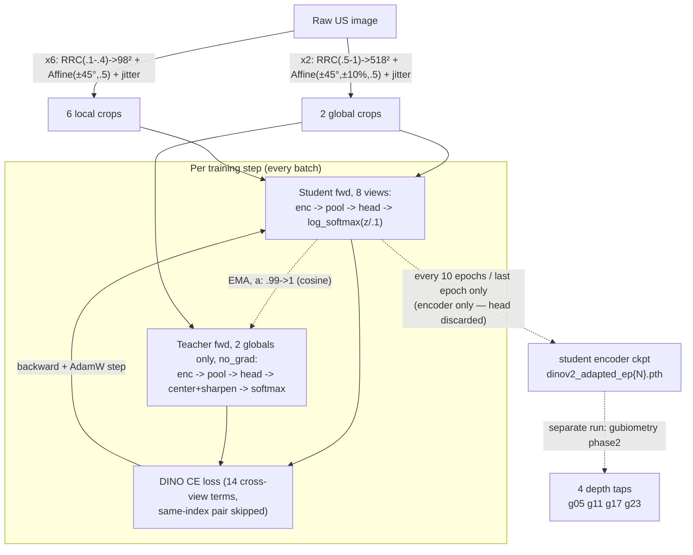
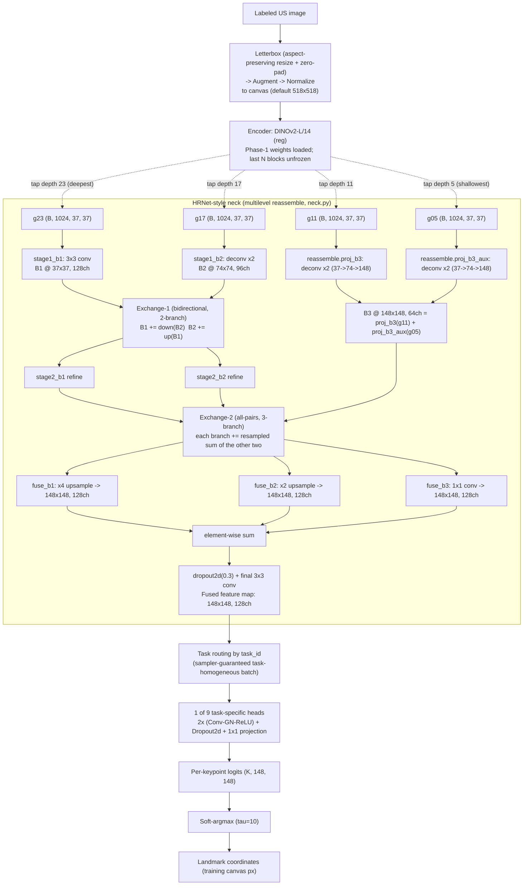
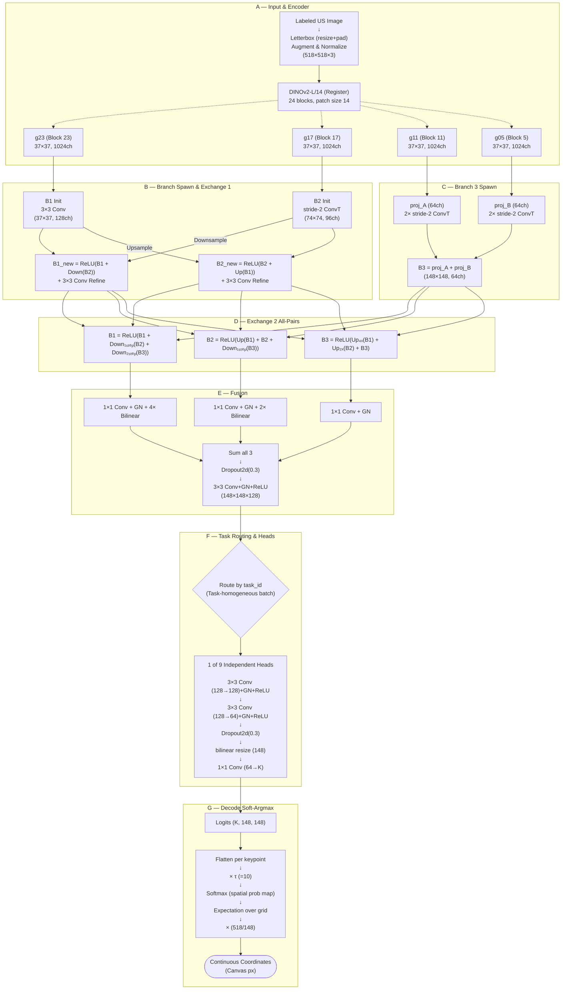
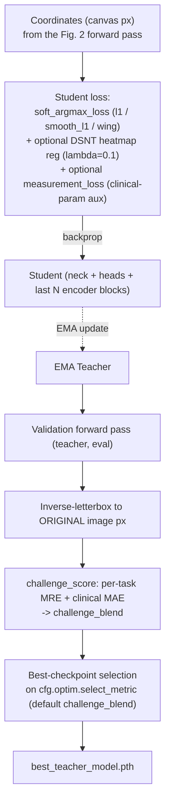

# Figure 1 — Corrected Pipeline Overview (reference for redraw)

This is a **reference sketch**, not the final figure. It exists so you can redraw
`docs/latex_template/Phases_architecture-all_pipeline_a.pdf` (source:
`docs/latex_template/pipeline_diagram.drawio`) by hand with the correct content,
without losing track of exactly what changed and why. Once you've redrawn it,
this file can be deleted.

## What's wrong in the current figure, and why

Checked against `METHOD_CHANGES.md` (the source of truth for what's actually the
default now) and the real implementation (`gubiometry/models/neck.py`,
`gubiometry/data/transforms.py`, `gubiometry/geometry.py`):

1. **Single 37×37 DINOv2 grid → multi-level extraction.** The default neck mode
   (`model.neck.input_mode: multilevel`, upgrade A2) feeds the neck from **four**
   intermediate ViT depths, not the last layer alone. Exact mapping, straight from
   `neck.py`'s own docstring: intermediate layers are extracted shallow→deep as
   `(g05, g11, g17, g23)`; deepest (**g23**) → branch 1 @ 37×37 (coarsest), **g17**
   → branch 2 @ 74×74, **g11 + g05** (summed, via two independent deconv projections
   `reassemble.proj_b3` / `proj_b3_aux`) → branch 3 @ 148×148 (finest). The
   current figure shows only one 37×37 grid feeding a monolithic "HRNetNeck" box —
   wrong for the default recipe.

   **This isn't only a Fig. 1 problem.** The paper's own Fig. 2 / `fig:neck-zoom`
   (`docs/latex_template/main.tex:109–137`) is *also* stale: its prose says B1 and
   B2 "are spawned directly and simultaneously from the initial grid" (i.e. one
   grid, matching `input_mode=single`) and B3 "is then bootstrapped from the
   exchanged B2 features" (`stage2_b3` deconv from B2 — the single-mode path in
   `neck.py:132-137`, not the current default `reassemble` path). It also cites
   `H=128` as the logit resolution (`main.tex:127,134`), the pre-upgrade-A7 value.
   Both figures need the same correction: multilevel taps in, 148×148 heads out.
2. **DINOv2 ViT-L/14 → register variant.** Upgrade A5 makes `dinov2_vitl14_reg`
   the default backbone (must match between Phase 1 and Phase 2).
3. **Head output 128×128 → 148×148.** Upgrade A7 raised the default heatmap
   resolution to 148×148 to match the neck's fused output (the figure already
   shows the fused map correctly as 148×148 — only the per-head logit box is stale).
4. **Final decode: fixed 518×518 canvas → original-image pixels.** Upgrade A1
   (metric-aligned scoring) inverse-letterboxes predictions back to
   **original-image pixels** before scoring, because that's the actual challenge
   metric space — 518 is only the training/loss canvas, not the output space.
   Multi-scale TTA (A6) further decodes at several canvases (490/518/546); the
   code invariant is that canvas is *never* hardcoded (see `geometry.py`'s
   `soft_argmax_coords(..., canvas=...)` and `CLAUDE.md`). A figure that ends at
   "Landmark coordinates (518×518 canvas)" misstates the actual output space.

## On your "resize" question

Checked `gubiometry/data/transforms.py`. This is **not a plain resize** — a naive
resize would squash/stretch the image to fill 518×518 and distort spatial
relationships between keypoints, which matters directly for angle/ellipse-based
measurements like AOP and HC. What the code actually does
(`get_train_transforms`, `letterbox_to_tensor`) is:

```
A.LongestMaxSize(max_size=canvas)                              # shrink, aspect preserved
A.PadIfNeeded(min_height=canvas, min_width=canvas, fill=0)      # zero-pad the short side
```

i.e. a **letterbox**: shrink proportionally so the longest side hits the canvas
size, then zero-pad the shorter side to fill the square — the same idea as
letterboxing a widescreen video into a square frame. Aspect ratio is preserved;
nothing is squashed.

Confirmed order in code: **letterbox (resize + pad) → augment → normalize →
tensor**. Your figure's box order ("resize · pad · augment · normalize") is
already sequenced correctly — the only problem is the word "resize" on its own,
which reads as a naive squash-to-fit resize to someone who hasn't seen the code.

**Recommended replacement label** for that box:

> Letterbox (aspect-preserving resize + zero-pad) → Augment → Normalize

## Splitting into two figures

Per discussion: Figure 1 = **Phase 1 only** (SSL domain adaptation), Figure 2 =
**Phase 2 only** (HRNet neck + heads), matching the paper's existing two-figure
structure (`fig:pipeline` / `fig:neck-zoom`) rather than cramming both phases into
one diagram. We're describing **`multicrop` only** (`cfg.phase1.mode="multicrop"`,
the recommended/configured mode — `phase1.py:167-227`); `sameview` (`phase1.py:48-103`)
is the deprecated collapse-prone fallback and isn't worth a figure.

## Where multi-level extraction should live

Two things worth separating, because conflating them is the easiest way to draw
this wrong:

- **The taps themselves** (which depths, how many) are a Phase-1-output /
  Phase-2-input concern — a property of the *encoder interface*.
- **What each tap becomes** (which branch resolution, how it's projected/upsampled)
  is entirely a **neck** concern (`neck.py`'s `reassemble` mapping) — nothing about
  the encoder changes; DINOv2 is a ViT, so **every block's patch-token grid is the
  same 37×37 spatial resolution regardless of depth** (`(B, 1369, 1024)` at every
  one of the 24 blocks). The 37/74/148 numbers you see downstream come entirely
  from how much the neck's deconvs upsample each tap — not from anything shrinking
  inside the transformer. This is a common misreading of DPT-style figures, so it's
  worth an explicit annotation wherever the taps are drawn.

This maps naturally onto your two-figure split and is exactly how DPT
(Ranftl et al., 2021) and ViTPose+/HRFormer draw it: a single ViT column with
short **dashed tap lines** peeling off at labeled depths into a compact
"Reassemble" block, with the actual multi-resolution fan-out drawn only in the
figure that owns the neck. Concretely:

- **Figure 1** (end of the Phase-1 diagram, below): show the adapted encoder with
  **4 short dashed taps** labeled `g05 g11 g17 g23`, annotated "all 37×37 — same
  spatial resolution, different semantic depth" — just enough to signal "this
  isn't the old last-layer-only encoder" without pre-empting Figure 2.
- **Figure 2** (top of the Phase-2 diagram, below): re-draw those same 4 taps and
  immediately fan them into the `reassemble`/`stage1_b*` projections, since that's
  where the resolution story (which tap → which branch → how much upsampling)
  actually belongs.

## Mermaid — Figure 1: Phase 1 (SSL domain adaptation, `multicrop`)

Node/edge boundary = actual code cadence: inside `LOOP` runs every batch; outside it
runs once per epoch (throttled) or in a later, separate script invocation.


+ ImageNet normalize, identical stats, both crop types (omitted above for density).

## Mermaid — Figure 2: Phase 2 (HRNet neck + task heads)

Scope matches the paper's `fig:neck-zoom` (architecture up to soft-argmax
decoding, not the training/validation loop — see the optional supplementary
diagram further down if you want that too).



## Mermaid — Figure 2, presentation variant (explicit all-pairs, no fill colors)

Checked node-by-node against `neck.py`/`heads.py`/`geometry.py` (same source as the
reproduction spec above) — every shape, channel count, and exchange formula is
correct. Differs from the plain version above in one way: it draws Exchange-2 as
three separate output nodes each wired from all three inputs (9 edges) instead of
one collapsed `EX2` node — a more literal rendering of "all-pairs" at the cost of
nine crossing lines. (Fill-color coding removed — low-contrast text inside filled
nodes; plain black-on-white throughout, matching the other diagrams in this doc.)



## Figure 2 (Phase 2) — methodology-section prose

All defaults below are the dataclass/config defaults (`gubiometry/config.py`,
`configs/phase2_upgraded.yaml`) — i.e. this describes what the code actually runs
with no overrides, not a hypothetical variant.

> Phase 2 attaches an HRNet-style multi-resolution neck and nine task-specific
> heads to the Phase-1-adapted DINOv2-L/14 register-variant encoder, producing
> continuous landmark coordinates via soft-argmax.
>
> Input images are letterboxed (aspect-preserving resize + zero-pad) to a square
> 518×518 canvas, augmented, and normalized with ImageNet statistics before being
> passed through the encoder. Because the ViT patch embedding has stride 14, this
> yields a 37×37 grid of 1024-dimensional patch tokens at *every one* of the
> encoder's 24 transformer blocks — spatial resolution is constant with depth;
> only the semantic content of the tokens changes. Rather than reading out only
> the final block, we tap four intermediate depths, shallow to deep — blocks 5,
> 11, 17, and 23 — each returned as a normalized $(B, 1024, 37, 37)$ grid.
>
> These four taps feed a three-branch neck that fuses them top-down rather than
> bottom-up: higher-resolution branches are expanded outward from the already-
> semantic $37\times37$ grid rather than built by progressively downsampling an
> image-resolution feature map. The two deepest taps spawn the first two branches
> directly and simultaneously: the deepest tap initializes branch $B_1$
> ($37\times37$, 128ch) via a $3\times3$ convolution, and the next-deepest
> initializes branch $B_2$ ($74\times74$, 96ch) via a stride-2 transposed
> convolution. $B_1$ and $B_2$ then undergo one bidirectional exchange: each
> branch is updated by summing its own features with a resampled projection of
> the other, followed by ReLU — downsampling via a stride-2 $3\times3$
> convolution with GroupNorm, upsampling via a $1\times1$ channel projection plus
> bilinear interpolation — and each branch receives one further refinement
> convolution. The third, finest branch $B_3$ ($148\times148$, 64ch) is then
> bootstrapped independently from the two *shallowest* taps: each is projected
> through its own two-stage transposed-convolution stack ($37\to74\to148$) and
> the two results are summed. All three branches then participate in one dense,
> all-pairs exchange, where each branch is updated by summing its own features
> with resampled projections of *both* other branches, again followed by ReLU.
> After this final exchange, all three branches are projected to a common
> 128-channel, $148\times148$ representation ($B_1$, $B_2$ via $1\times1$
> convolution plus $4\times$/$2\times$ bilinear upsampling respectively; $B_3$ via
> a $1\times1$ convolution only) and fused by element-wise summation, followed by
> 2D dropout ($p=0.3$) and one $3\times3$ convolution refinement — yielding the
> final $148\times148\times128$ fused feature map.
>
> Because training batches are sampled task-homogeneously, the fused feature map
> is routed — by the batch's known task identity, not a learned gate — to exactly
> one of nine independent task-specific heads (A4C, AOP, FA, FUGC, HC, IVC, PLAX,
> PSAX, fetal\_femur; $K \in \{16, 4, 4, 2, 4, 2, 22, 4, 2\}$ keypoints
> respectively). Each head applies two Conv-GroupNorm-ReLU blocks
> ($128\to128\to64$ channels) with 2D dropout, resizes (bilinear interpolation —
> a no-op at the default resolution) to a $148\times148$ working resolution, and
> projects to $K$ per-keypoint logits via a final $1\times1$ convolution.
>
> Continuous coordinates are extracted via soft-argmax: the $K\times148\times148$
> logits are flattened per keypoint, scaled by temperature $\tau=10$, and passed
> through a softmax to obtain a spatial probability distribution over the grid;
> the coordinate is the probability-weighted expectation over grid locations,
> rescaled by $\text{canvas}/H$ ($=518/148$ at training resolution) to map
> grid units back into canvas pixels.

## Figure 2 — full reproduction spec (node-by-node, for redrawing by hand)

Every shape/channel count is load-bearing (verified against `neck.py`, `heads.py`,
`model.py`, `geometry.py`, `constants.py`) — if you redraw this without code
access, these are the numbers that must not drift.

**A — Input & encoder taps**
- Input: labeled US image → letterbox (resize+pad) → augment → normalize → 518×518×3
- Encoder: DINOv2-L/14, register variant, 24 blocks, patch size 14, embed_dim 1024
  → patch grid is 518/14 = **37×37** at every block
- 4 dashed taps off the encoder, labeled by block index (not "layer count from end"):
  block 23 (deepest) → `g23`, block 17 → `g17`, block 11 → `g11`, block 5
  (shallowest) → `g05`. All four: **(B, 1024, 37, 37)**.

**B — Branch spawn + Exchange-1 (2-branch)**
- `g23` → 3×3 conv → **B1** (37×37, **128ch**)
- `g17` → stride-2 ConvTranspose2d → **B2** (74×74, **96ch**)
- Exchange-1: `B1_new = ReLU(B1 + Downsample₁ₛₜₑₚ(B2))`,
  `B2_new = ReLU(B2 + Upsample(B1))`
- Refine: B1 → 3×3 conv (128→128); B2 → 3×3 conv (96→96)

**C — Branch-3 spawn (the multilevel-specific part)**
- `g11` → 2× stride-2 ConvTranspose2d (37→74→148) → proj_A (**64ch**)
- `g05` → 2× stride-2 ConvTranspose2d (37→74→148), *separate weights* → proj_B (**64ch**)
- **B3 = proj_A + proj_B** (148×148, 64ch)

**D — Exchange-2 (3-branch, all-pairs)**
- `B1 = ReLU(B1 + Down₁ₛₜₑₚ(B2) + Down₂ₛₜₑₚ(B3))`
- `B2 = ReLU(Up(B1) + B2 + Down₁ₛₜₑₚ(B3))`
- `B3 = ReLU(Up₄ₓ(B1) + Up₂ₓ(B2) + B3)`
- Downsample = chained stride-2 3×3 conv+GroupNorm (1 step per 2× gap: so B3→B1
  needs 2 chained steps for the 4× gap); Upsample = 1×1 conv+GroupNorm + bilinear

**E — Fusion**
- B1 → 1×1 conv + GN + bilinear ×4 → 148×148×128
- B2 → 1×1 conv + GN + bilinear ×2 → 148×148×128
- B3 → 1×1 conv + GN (already 148×148) → 148×148×128
- Sum all three → Dropout2d(0.3) → 3×3 conv+GN+ReLU → **fused map: 148×148×128**

**F — Task routing + heads**
- Route by `task_id` (task-homogeneous batch) to 1 of 9 heads (`nn.ModuleDict`)
- Per head: 3×3 conv (128→128)+GN+ReLU → 3×3 conv (128→64)+GN+ReLU → Dropout2d(0.3)
  → bilinear resize to `heatmap_size=148` (no-op at default) → 1×1 conv (64→K)
- K per task: A4C 16, AOP 4, FA 4, FUGC 2, HC 4, IVC 2, PLAX 22, PSAX 4,
  fetal_femur 2 (`constants.TASK_KEYPOINTS`)

**G — Decode**
- logits (K,148,148) → flatten per keypoint → ×τ(=10) → softmax → spatial
  probability map → expectation over (x,y) grid → × (canvas/H = 518/148) →
  **coordinates in canvas px**

Not part of this architecture spec (training-only — see the supplementary
diagram below): the coordinate-regression loss, optional DSNT regularizer, EMA
teacher, inverse-letterbox-to-original-px, and challenge-metric checkpoint
selection.

### Optional supplementary — training & checkpoint selection

Not part of the paper's architecture figure (it's recipe, not architecture), but
useful if you want one diagram covering how Phase 2 is actually trained/selected:



## Not shown (intentionally, keep the architecture figures high-level)

Optimizer/loss/workflow-level upgrades that don't belong in an architecture
diagram — covered by the supplementary training diagram above or by prose:
layer-wise LR decay (A3), the DSNT heatmap regularizer (A4), 5-fold CV + ensemble
+ TTA as a workflow (A6 — for the *inference* side, multi-scale TTA decodes at
several canvases 490/518/546 via `geometry.py`'s `soft_argmax_coords(..., canvas=...)`,
worth one small annotation near a "Predict" figure if you draw one, but it's out
of scope for Figs. 1–2 which cover training-time architecture only).
