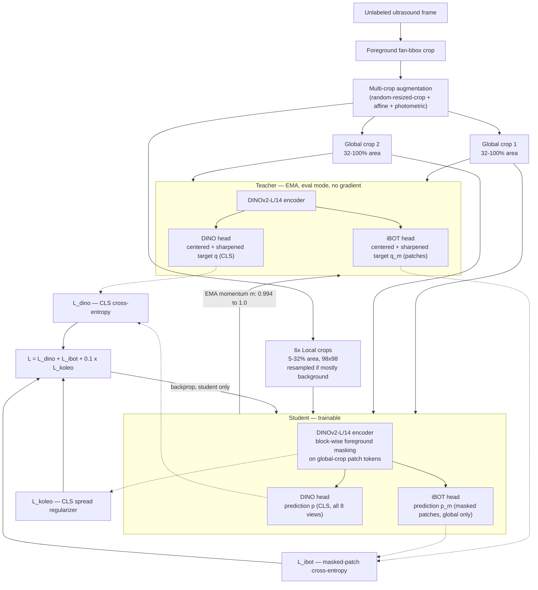
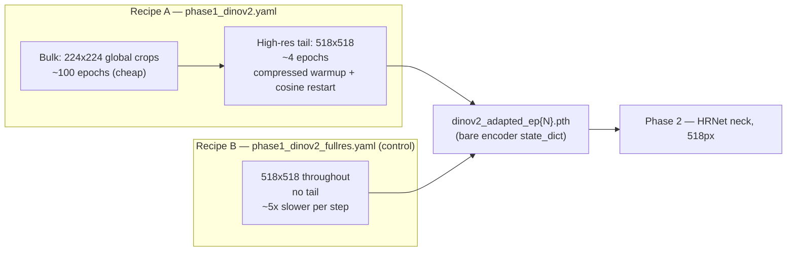

# Phase 1 (DINOv2-faithful) — Methodology draft for later revision

**Status:** draft only, not yet merged into `main.tex`. Written for when the `phase1_dinov2` /
`phase1_dinov2_fullres` experiments (see `EXPERIMENT_RESULTS.md`) are finished and you're ready to
revise the manuscript's Phase 1 description. Grounded directly in `gubiometry/engine/phase1_dinov2.py`
and `gubiometry/models/dino_ssl.py` as of commit `c8338fb` (2026-07-22).

Covers **both** `phase1_dinov2.yaml` (224-bulk + 518-tail) and `phase1_dinov2_fullres.yaml`
(518-throughout, no tail) — same code path (`train_dinov2`), only the resolution schedule differs.

---

## Prose draft — "2.1 Phase 1: Self-Supervised Domain Adaptation"

*(LaTeX-ready; drop-in replacement for the current Methodology 2.1 in `main.tex`. Matches the
existing subsection's density/notation style — one paragraph of setup, two combined-loss equations,
one paragraph on the EMA teacher and resolution curriculum.)*

> We adapt the register-variant DINOv2-L/14 encoder~\cite{oquab2023dinov2} to unlabeled ultrasound
> frames with a DINOv2-faithful continued-pretraining recipe, combining CLS-token self-distillation~\cite{caron2021dino},
> masked patch-token prediction~\cite{zhou2022ibot}, and an entropic spread regularizer~\cite{sablayrolles2018spreading}.
> As before, a local-to-global multi-crop strategy generates eight augmented views: two \emph{global}
> crops (32--100\% of the image area) and six \emph{local} crops (5--32\% of the area, $98\times98$),
> all pre-restricted to the ultrasound fan's foreground bounding box and resampled if a local crop
> lands mostly on background, so crops are not wasted on the uninformative black border common to
> sonographic frames. A trainable student processes all eight views; an exponential-moving-average
> (EMA) teacher, held in evaluation mode, processes only the two global views.
>
> Both branches project their CLS token through a three-layer MLP head, an $L_2$-normalized
> bottleneck, and a weight-normalized final layer~\cite{oquab2023dinov2} into $K{=}65{,}536$
> prototypes. The teacher's logits are centered against a running EMA estimate and sharpened at a
> warmup teacher temperature (annealed $0.04\rightarrow0.07$ over the first 30 epochs); the
> student's are temperature-scaled and log-softmaxed --- the same centering-and-sharpening mechanism
> as standard DINO self-distillation~\cite{caron2021dino}, now applied independently to two
> prediction heads (CLS-level and patch-level) rather than one. In addition to the CLS-level loss
> $\mathcal{L}_{\mathrm{dino}}$, a block-wise subset of the student's global-crop patch tokens is
> masked (capped at 50\% of tokens, restricted to foreground/tissue patches) and passed through a
> second, separately weight-normalized head; the student must recover the teacher's (unmasked,
> centered, sharpened) representation for each masked patch, giving a dense, patch-level loss:
> $$
> \mathcal{L}_{\mathrm{ibot}} = -\frac{1}{|\mathcal{M}|}\sum_{m\in\mathcal{M}} q_m \log p_m ,
> \label{eq:ibot-loss}
> $$
> where $\mathcal{M}$ is the set of masked foreground patches across the two global crops, $q_m$ the
> teacher's centered target and $p_m$ the student's prediction for patch $m$. A
> Kozachenko--Leonenko entropic term $\mathcal{L}_{\mathrm{koleo}}$~\cite{sablayrolles2018spreading}
> additionally penalizes overly similar CLS embeddings within a batch, discouraging representational
> collapse independently of the centering mechanism. The three terms combine as
> $$
> \mathcal{L} = \mathcal{L}_{\mathrm{dino}} + \mathcal{L}_{\mathrm{ibot}} + 0.1\,\mathcal{L}_{\mathrm{koleo}} .
> \label{eq:dino-combined}
> $$
>
> The teacher receives no gradient and is updated as $\theta_t \leftarrow m\,\theta_t + (1-m)\,\theta_s$,
> with $m$ annealed from $0.994$ to $1.0$ on a cosine schedule; the projection heads' final layer is
> additionally frozen (zero learning rate) for the first epoch, a standard stabilization measure
> against early prototype collapse. Gradient accumulation maintains a large effective batch size of
> 256 throughout. Pretraining follows a two-resolution curriculum: the bulk of training runs at a low
> $224\times224$ global-crop resolution (five-fold cheaper per step than $518\times518$), followed by
> a short high-resolution adaptation tail at $518\times518$ --- the resolution used by Phase 2 --- with
> a compressed warmup-and-cosine restart of all schedules, so the encoder's features are finally tuned
> at the deployment scale rather than only at the cheap pretraining scale.

Word count: ~420 words + 2 short equations — should land under a page including the existing
Figure 1 pipeline diagram (or its updated version, see below), consistent with the current
subsection's length.

---

## Citations still needed

Neither of these is in `mybibliography.bib` yet — add before merging:

- `zhou2022ibot` — Zhou et al., *"iBOT: Image BERT Pre-Training with Online Tokenizer,"* ICLR 2022.
- `sablayrolles2018spreading` — Sablayrolles et al., *"Spreading Vectors for Similarity Search,"* ICLR 2019 (this is the actual KoLeo source; the vendored code's own docstring in `dino_ssl.py:147` cites it as "Sablayrolles et al. 2018" — double-check the exact venue/year before adding the `.bib` entry, since ICLR 2019 papers are sometimes dated by their arXiv year).

---

## Integration notes (for your later revision pass)

- **This replaces, not supplements**, the current 2.1 prose — don't run both descriptions side by
  side. The equation numbering above is self-contained and doesn't depend on the old
  `eq:ssl-loss` still existing.
- **Figure 1** (`fig:pipeline`) will need a new diagram to match — see the Mermaid sketches below as
  a starting point for a redrawn version. The current figure only shows the single-loss CLS
  self-distillation box; it doesn't have a slot for iBOT/KoLeo or the two-resolution curriculum.
- **"Dataset and Preprocessing"** (2.4-ish) currently says Phase 1's augmentation recipe is
  "rotation up to $\pm45^\circ$, gamma/contrast changes, CLAHE, Gaussian blur and noise." The new
  recipe (`aug: us_v2`) uses $\pm10^\circ$ rotation instead, plus foreground-bbox cropping,
  background-reject resampling for local crops, and foreground-restricted iBOT masking — that
  paragraph needs updating too, not just 2.1.
- If you keep a sentence contrasting against the old `multicrop` recipe (per your
  `EXPERIMENT_RESULTS.md` narrative — "old SSL hurt, new SSL fixed it"), the two headline
  differences to name are: (1) dense iBOT patch supervision + KoLeo vs. CLS-only distillation with
  no anti-collapse term, and (2) a real correctness fix — the old recipe never called
  `teacher.eval()`, so its head's `BatchNorm1d` ran on live per-batch statistics instead of a stable
  target; the new `DINOHead` has no BatchNorm at all.
- Backbone (register-variant DINOv2-L/14) is unchanged from the current draft — no need to touch
  that sentence elsewhere in the paper.

---

## Diagram 1 — per-step architecture (student/teacher forward + losses)

## Diagram 2 — two-resolution training curriculum

